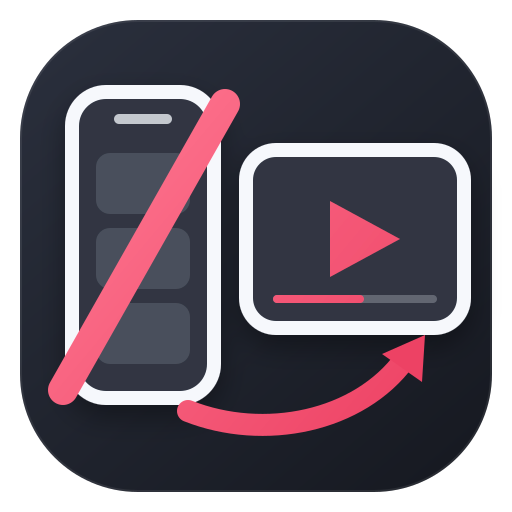

  

<h1 align="center">禁止竖屏</h1>

  <a href="README.md">简体中文</a> | <a href="README_EN.md">English</a>

<strong>让哔哩哔哩竖屏视频回到传统视频播放器。</strong>

点击竖屏视频时，不再进入“看一看”竖屏信息流，而是像普通视频一样使用传统播放器打开。

## 效果

- 将 `story` 竖屏视频入口重定向到传统视频播放器。
- 首页卡片仍然显示竖屏标识，点击后使用传统视频播放器播放。
- 模块启用后自动生效，无需单独配置。

## 安装与兼容性

开始前，请确认设备已经 Root，并已安装支持传统 Xposed API 的框架。推荐使用 LSPosed 2.x（[下载链接](https://lsposed.zip)），本模块已在 LSPosed 2.1.1（7790）上验证。其他兼容传统 Xposed API 的框架，例如 [Vector](https://github.com/JingMatrix/Vector)，目前尚未完成真机验证。

哔哩哔哩版本支持情况：

- 标准版 `tv.danmaku.bili`：已验证 8.60.0、8.97.0。
- 其他 8.x 版本：可能兼容，但未逐版本验证。
- 国际版 `com.bilibili.app.in`：已提供作用域支持，但尚未测试。

安装步骤：

1. 从 [Releases](https://github.com/zombie12138/no-bili-portrait/releases) 下载并安装最新 APK。
2. 在 Xposed 框架管理器中启用“禁止竖屏”。
3. 设置模块作用域。标准版选择 `tv.danmaku.bili`，国际版选择 `com.bilibili.app.in`。
4. 强行停止哔哩哔哩，然后重新打开。
5. 点击一个竖屏视频，确认它进入传统视频播放器。

## 工作原理

哔哩哔哩通过内部链接决定打开哪一种播放器：

- `bilibili://story/...` 打开“看一看”竖屏信息流。
- `bilibili://video/...` 打开传统视频播放器。

本模块在路由请求创建时拦截 `story` 链接，并将它改写成 `video` 链接。

## 问题反馈

如果模块没有生效，请先检查 Xposed 框架是否工作、模块是否启用、作用域是否正确，并强行停止后重新打开哔哩哔哩。仍有问题时，请尝试重启设备。

如果问题仍然存在，请在 [Issues](https://github.com/zombie12138/no-bili-portrait/issues) 反馈，并附上模块版本、哔哩哔哩版本、Android 版本、Xposed 框架版本和相关日志。

## 致谢

本项目基于 [WankkoRee/Portrait2Landscape](https://github.com/WankkoRee/Portrait2Landscape) 修改，感谢原作者提供的实现思路。

## 许可证

本项目采用 [GPL-3.0](LICENSE) 许可证。
